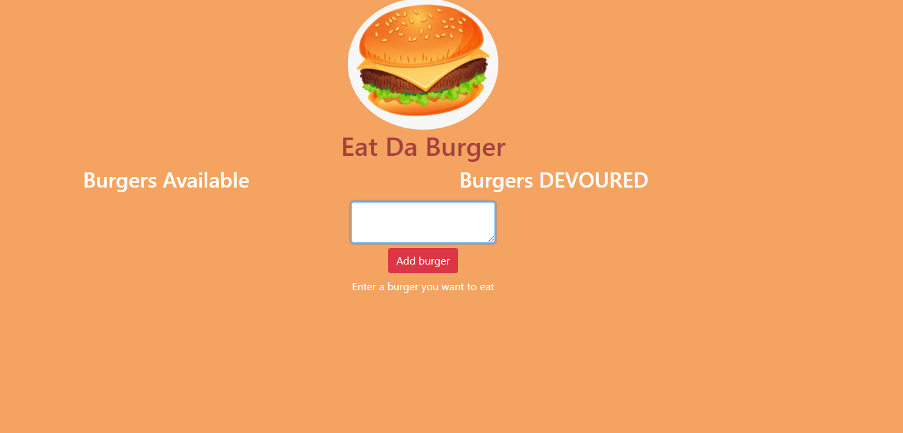

# eat-da-burger

This burger logger app is created with MySQL, Node, Express, Handlebars and a homemade ORM also followed the MVC design pattern and used Node and MySQL to query and route data in app, and Handlebars to generate your HTML.

#### Directory structure

All the recommended files and directories from the steps above should look like the following structure:

```
.
├── config
│   ├── connection.js
│   └── orm.js
│ 
├── controllers
│   └── burgers_controller.js
│
├── db
│   ├── schema.sql
│   └── seeds.sql
│
├── models
│   └── burger.js
│ 
├── node_modules
│ 
├── package.json
│
├── public
│   └── assets
│       ├── css
│       │   └── burger_style.css
│       └── img
│           └── burger.png
│   
│
├── server.js
│
└── views
    ├── index.handlebars
    └── layouts
        └── main.handlebars
```

### Application link

* [GitHub repositories](https://github.com/mugich/eat-da-burger)
* [Heroku deployed link](https://enigmatic-reaches-88280.herokuapp.com/)


### Application's appearance

